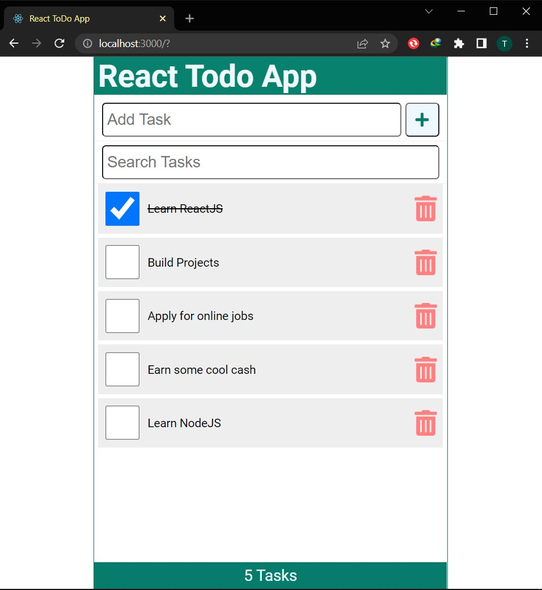

# React ToDo App

A todo app created with ReactJS

### App Screenshot



### App Functions

The app does the following:

- Add new tasks
- Delete and existing task
- Check a task (mark it as done)
- Uncheck a task
- Stores tasks in localstorage so they are not lost on browser reload or restart.
- Real time search for tasks

---

```js
console.log("Hello React!🎉🎉");
```

## Author

[Thomas Burns Botchwey](https://www.linkedin.com/in/tbbotchwey)

## Credit

[Dave Gray](https://www.youtube.com/c/DaveGrayTeachesCode)
